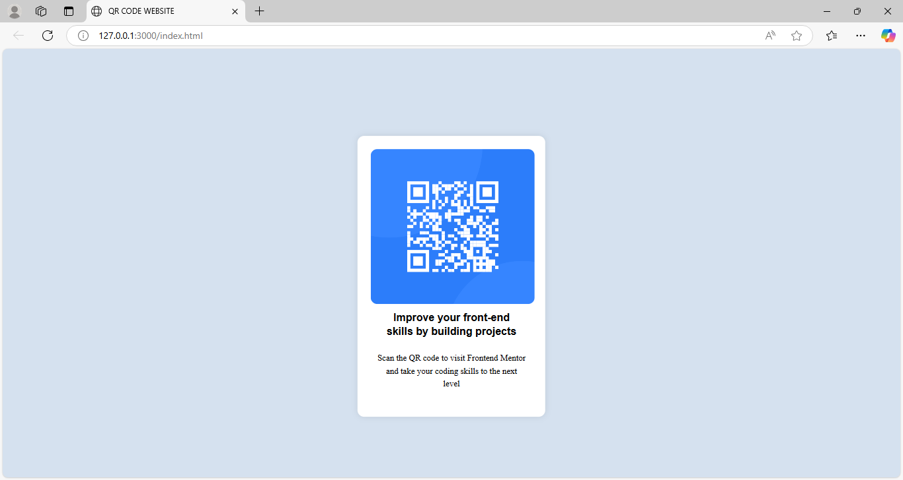

# QR Code Website  

A simple and responsive QR Code website built with HTML and CSS.

## 📸 Preview  



## 🚀 Features  
- Generates QR codes dynamically  
- Clean and modern UI  
- Mobile-responsive design  

## 🔧 Technologies Used  
- HTML  
- CSS  
  

## 🛠️ Installation  
1. Clone the repository:  
   ```sh
   git clone https://github.com/echo-script0/qr-code-website.git

📜 License
This project is licensed under the MIT License.

👤 Author
Aisha Adeyemo
